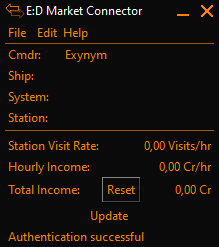

# Hourly Income EDMC Plugin

This is a simple plugin to [EDMarketConnector](https://github.com/Marginal/EDMarketConnector/wiki), based on and adapted from the [EDMCJumpSpeed](https://github.com/inorton/EDMCJumpSpeed) plugin, so credit for most of the work done should be directed to their makers!



As with the JumpSpeed plugin, simply unzip the directory into your plugins folder yielding a structure similar to
```
EDMarketConnector\plugins\EDMC-HourlyIncome-master\load.py
```
and restart EDMC afterwards.
